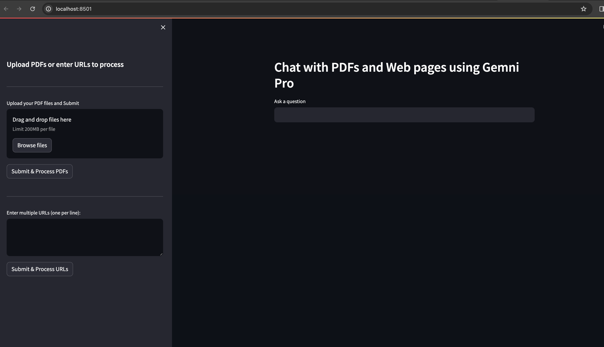

#### RAG pipeline using LangChain, Gemini pro, Faiss
This is a simple RAG pipeline that can talk with PDF files and Web pages. The pipeline has been deployed using Streamlit. 



#### Local Installation
Prerequisites
- Python 3.11
- Poetry

#### Installing Poetry
If you haven't already installed Poetry in your machine, you can do so by following the instructions on the [official Poetry website](https://python-poetry.org/docs/).

#### Setting Up the Project
1. Clone the repo
```bash
git clone git@github.com:sksoumik/chat-with-doc.git
cd chat-with-doc
```
2. Install Dependencies

Using Poetry, you can install all the dependencies defined in the pyproject.toml file.

```bash
poetry install
```
3. Add Gemni Pro API

Get your [Gemini Pro API key](https://makersuite.google.com/app/apikey) 

Create a `.env` file in the project root folder and add the API key like below (add yours, the following won't work):
```bash
GOOGLE_API_KEY = "YZzaSyB183kjbiaGIkbsdafbjN5o37OphpjZAy989bas"
```

#### Run the app

From the project root directory, run the following command: 
```
streamlit run main.py
```
The app will open in your browser.